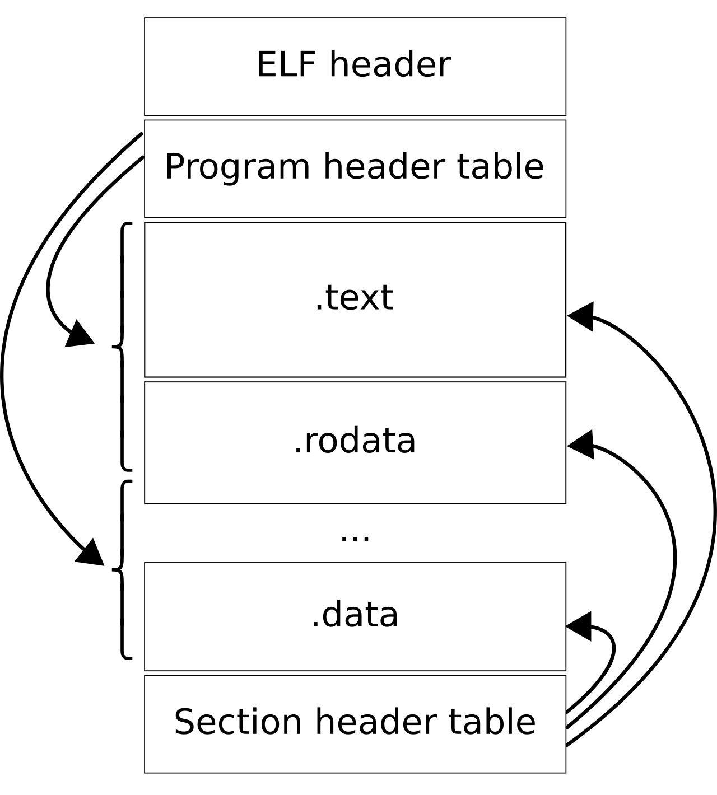

## Executable and Linkable Format

The [ELF](https://en.wikipedia.org/wiki/Executable_and_Linkable_Format) is a common standard file format for executable files, object code, shared libraries, and core dumps. First published in the specification for the application binary interface (ABI) of the Unix operating system version named System V Release 4 ([SVR4](https://www.sco.com/developers/devspecs/gabi41.pdf)), and later in the [Tool Interface Standard](https://refspecs.linuxbase.org/elf/elf.pdf), it was quickly accepted among different vendors of Unix systems. In 1999, it was chosen as the standard binary file format for Unix and Unix-like systems on x86 processors by the 86open project.

By design, the [ELF format](https://refspecs.linuxbase.org/elf/elf.pdf) is flexible, extensible, and cross-platform. For instance, it supports different endiannesses and address sizes so it does not exclude any particular CPU or instruction set architecture. This has allowed it to be adopted by many different operating systems on many different hardware platforms.

## ULPatch ELF Format

TODO
